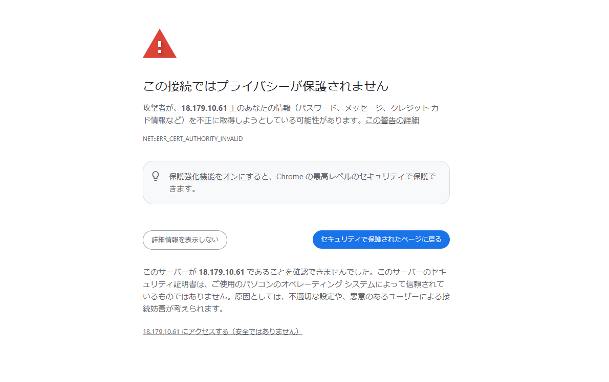
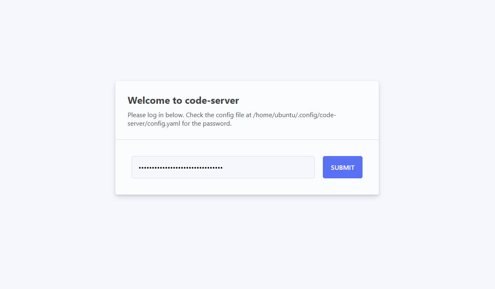
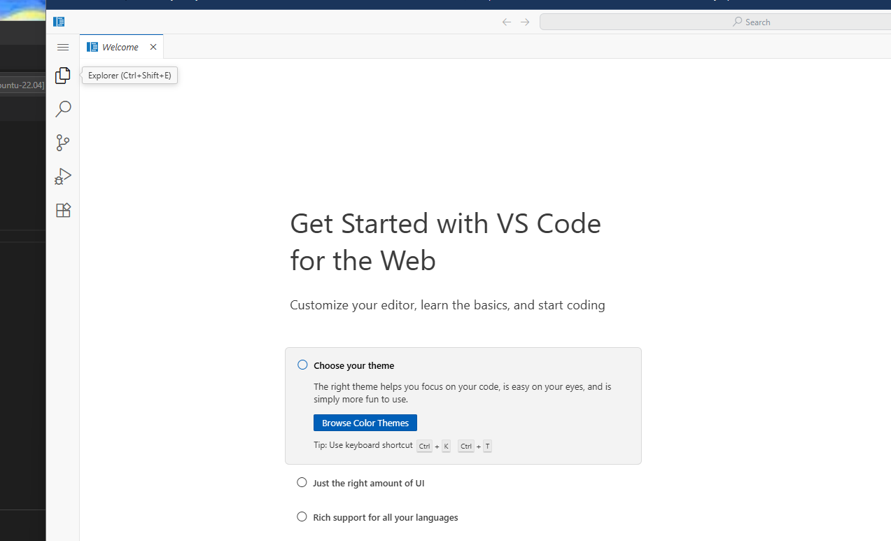
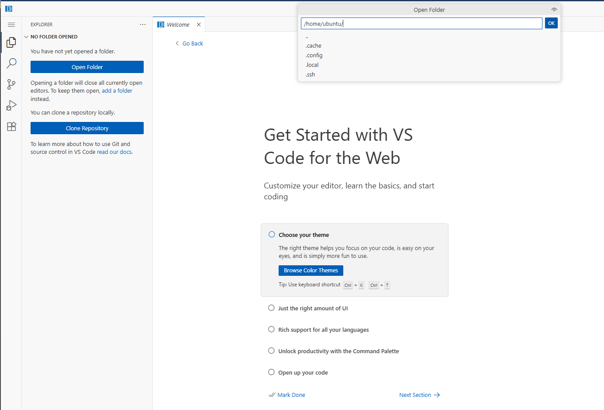
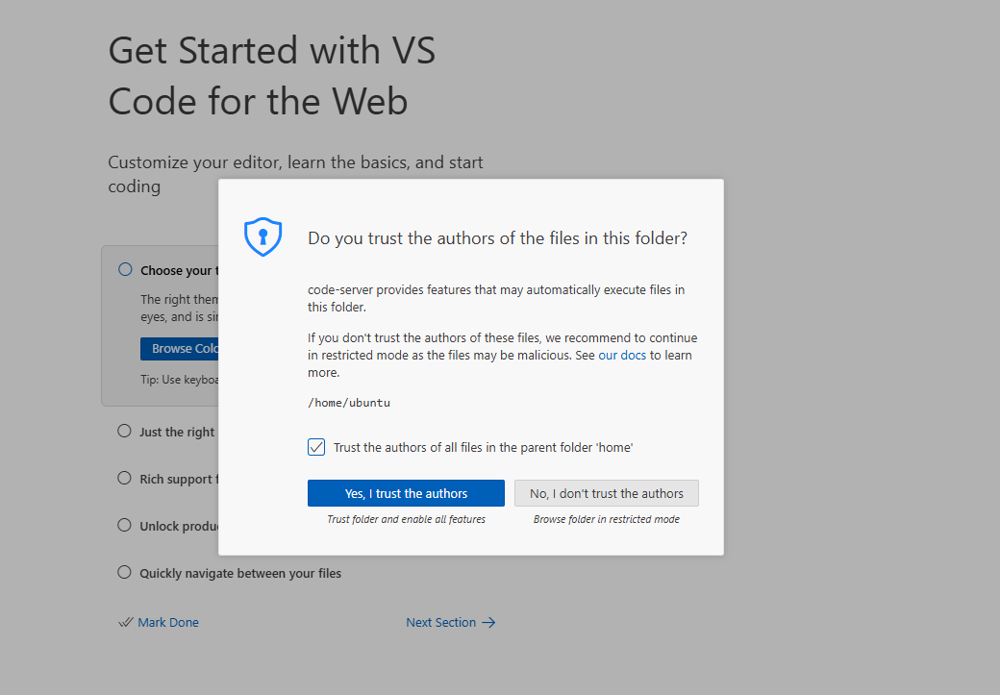
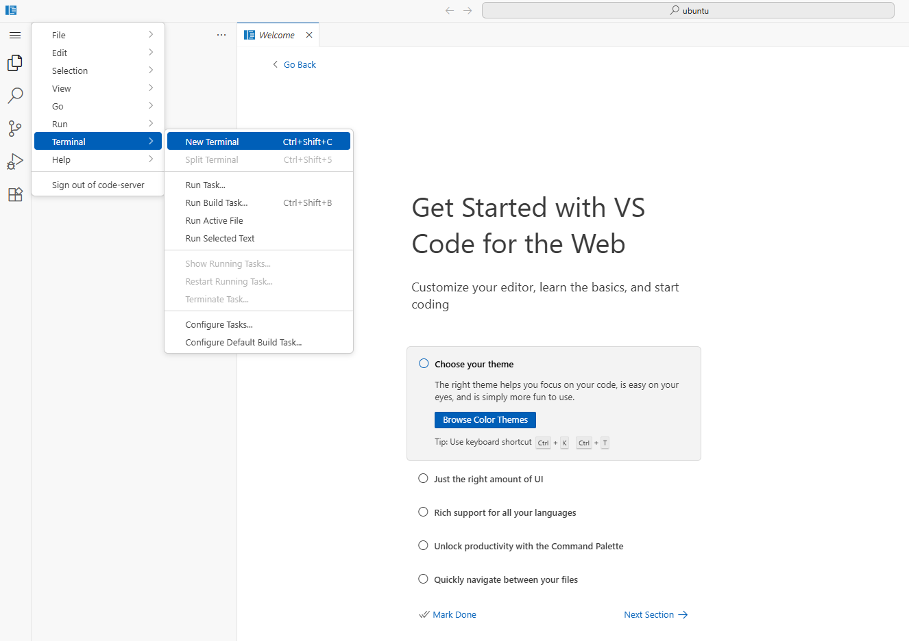
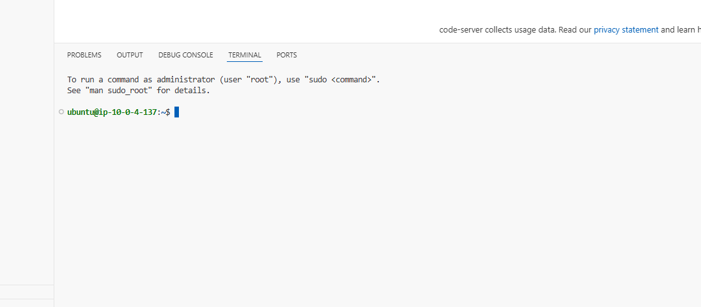

# ハンズオン手順

## 1. 接続

### 1.1 事前に配布された URL へアクセス

以下のような警告が出るが、「アクセスする」を押下



### 1.2 事前に配布された PW を入力して SUBMIT



VS Code のような画面に遷移したら、ログイン成功。

### 1.3 左上のファイルボタン(Explorer)を押下



### 1.4 「Open Folder」をクリックし、中央の入力欄が「/home/ubuntu(初期表示)」になっている事を確認し、OK



### 1.5 「このフォルダを信用するか?」と聞かれるので、Yes を押下



これでフォルダを開く事が出来る

### 1.6 エクスプローラボタンの上のメニューボタン(三本線)をクリックし、「terminal」->「New Terminal」をクリック



### 1.7 画面の下にコマンドプロンプトが表示されれば、準備完了



---

## 2. コードの準備

### 2.1 「おまじない」を入力

AWS アカウント ID を取得し、環境変数に格納する。

```bash
export ACCOUNT_ID=$(aws sts get-caller-identity --query Account --output text)
```

### 2.2 サンプルコードをクローン

GitHub からコードをダウンロードする事を「クローン」と呼ぶ

```bash
git clone https://github.com/issei-hamada/hmddev-lambda-web-adapter-workshop.git
```

クローン完了後、「mddev-lambda-web-adapter-workshop」フォルダが作成される。

### 2.3 作成されたフォルダに移動

```bash
cd hmddev-lambda-web-adapter-workshop/
```

### 2.4 前半で作成したコードをドラッグ&ドロップし、hmddev-lambda-web-adapter-workshop/app配下に配置する

- ファイルの名称を**main.py**にする
- 既に同じ名前のファイルが存在するが、上書きしてよい

ここまででコードの準備は完了

---

## 3. ビルド

### 以下コマンドを入力し、コードをビルドする

※ ビルド=コードを公開する為、関係する部品を全てまとめて1つのパッケージにする事

```bash
sam build
```

---

## 4. デプロイ

### 4.1 以下コマンドを入力し、デプロイプロセスを開始

※ デプロイ=ビルドしたコードを公開する事

```bash
sam deploy --guided --role-arn arn:aws:iam::$ACCOUNT_ID:role/workshop-cfn-execution-role
```

### 4.2 コマンドからの質問に1つずつ回答する

1. **Stack Name:** `ユーザ名-connpass-app`
2. **AWS Region:** `ap-northeast-1`
3. #Shows you resources changes to be deployed and require a 'Y' to initiate deploy Confirm changes before deploy: `y`
4. #SAM needs permission to be able to create roles to connect to the resources in your template Allow SAM CLI IAM role creation: `y`
5. #Preserves the state of previously provisioned resources when an operation fails Disable rollback: `n`
6. ApiFunction has no authentication. Is this okay?: `y`
7. Save arguments to configuration file: `y`
8. SAM configuration file [samconfig.toml]: 空欄
9. SAM configuration environment [default]: 空欄
10. Create managed ECR repositories for all functions?: `y`

ここまで入力すると、デプロイ準備が始まる。

### 4.3 デプロイ対象を確認されたら、**y** を入力

Deploy this changeset?: `y`

Successful! のようなメッセージが表示された場合、デプロイ完了。

### 4.4 デプロイ完了時、出力される情報の「Value」を控える

- Key: ApiURL
- Description: API Gateway endpoint URL for Prod stage for FastAPI function
- Value: https://v2jh7vu2a9.execute-api.ap-northeast-1.amazonaws.com/

これがデプロイされた API の URL です。

---

## 5. 動作確認

### 5.1 おまじないを入力

環境変数に、デプロイ結果で表示された URL を格納しておく。

```bash
export API_URL=デプロイ結果で表示されたURL
```

### 5.2 以下のコマンドを実行し、API の動作をテストする

```bash

# イベント一覧取得
curl ${API_URL}events

# イベント詳細取得
curl ${API_URL}events/{event_id}/detail

# 都道府県別イベント取得
curl ${API_URL}events/pref/{prefecture}

# グループ別イベント取得
curl ${API_URL}events/group/{subdomain}

# イベント数取得
curl ${API_URL}events/count

# イベント検索
curl -X POST -H "Content-Type: application/json" -d "{"keyword" : "xxx" , "prefecture" : "xxx", "subdomain": "xxx", "limit": "xxx"}" ${API_URL}events/filter

```

ハンズオンは以上です。
